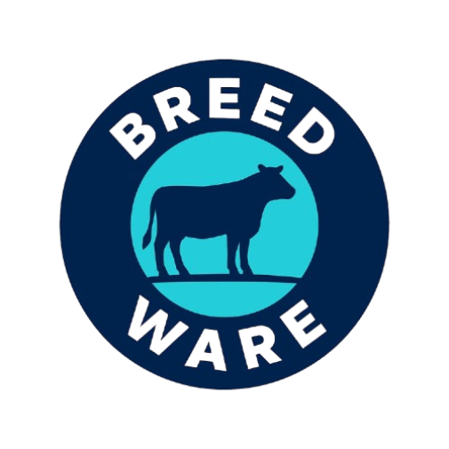

<div align="center">



# BreedBotics

**Snap a photo of a cow or buffalo, get the breed back, plus the numbers that matter to a small farm.**

[](https://breed-botics.vercel.app)
[](#tech-stack)
[](#tech-stack)
[](#tech-stack)
[](#tech-stack)

</div>

---

## The idea

Most breed-identification tools out there assume you already know what you're looking at. BreedBotics flips that. You upload a picture of the animal, the app runs it through an image-classification backend, and you get back the most likely breed with a confidence score. No jargon, and no dropdown of forty Latin names. Just a clear answer and a short note on the breed.

It was built with farmers and small livestock owners in mind, so the interface works in **English and Hindi** and the layout holds up on a phone.

> **Live site:** https://breed-botics.vercel.app

---

## What's in it

- **Breed recognition:** upload a photo (drag-and-drop or click), send it to the model service, and see the top prediction with an animated confidence bar.
- **Animal registration:** a bilingual form to log an animal's breed, age, and basic details. Covers 13 common breeds, split across cows (Gir, Sahiwal, Red Sindhi, Tharparkar, Rathi, Hariana, Holstein Friesian, Jersey) and buffaloes (Murrah, Jafarabadi, Surti, Nili Ravi, Bhadawari).
- **Farm analytics dashboard:** Chart.js charts for cattle registered, milk yield, and health alerts.
- **Supported-breeds catalogue:** a quick visual reference of breeds the model is familiar with.
- **Plans & upgrade page:** the product's subscription tiers, kept simple.
- **Auth pages:** login and signup screens with a password show/hide toggle.
- **Small conveniences:** responsive navbar with a hamburger menu, scroll-reveal animations via `IntersectionObserver`, and a geolocation helper.

---

## How recognition works

The front end collects the image and posts it as `multipart/form-data` to a companion Python/FastAPI service that exposes a `POST /predict` endpoint. That service returns a `top3` list of `{ class, confidence }` objects, and the UI renders the strongest match.

A heads-up so nobody is caught off guard: **in the deployed demo, that live model call is switched off.** The request code is still in [`script.js`](script.js) but commented out, and the page falls back to a small set of sample results so the flow can be demonstrated without the backend running. To wire it back up, point the fetcher at a running model service and uncomment the block in `recognizeBreed()`.

---

## Tech stack

| Layer | What it uses |
|---|---|
| Front end | HTML5, CSS3, vanilla JavaScript (no framework, no build step) |
| Charts | Chart.js (CDN) |
| Icons | Font Awesome 6 (CDN) |
| Model backend | External Python + FastAPI service (`POST /predict`) |
| Local dev server | `servor` via npm |
| Hosting | Vercel (static front end) |

---

## Project structure

```
index.html                  landing page — hero, features, analytics preview, video
breed-recognition.html      upload + prediction UI, supported-breeds catalogue
animal-registration.html    bilingual (EN/HI) animal registration form
upgrade.html                subscription plans
login.html / signup.html    auth screens
page2.html                  secondary page
styles.css                  all styling (~1.5k lines)
script.js                   app logic — upload, API call, charts, i18n, animations (~760 lines)
package.json                dev-server script
download.png                logo / favicon
```

---

## Running it locally

You only need Node if you want the reload-on-save dev server; otherwise the site is static and opens straight in a browser.

```bash
# clone
git clone https://github.com/KeshavGhatia/BreedBotics.git
cd BreedBotics

# install the dev server
npm install

# start with live reload (usually http://localhost:8080)
npm start
```

Or just double-click `index.html`.

To enable live predictions you'll also need the FastAPI model service running somewhere reachable, then re-enable the fetch call in `script.js` as described above.

---

## Notes and limitations

- The recognition logic lives in a **separate Python/FastAPI service** — this repository is the front end only.
- The sample results shown in the deployed demo are illustrative, not model output.
- The site advertises support for "50+ breeds"; the registration form currently covers **13**, and the catalogue on the recognition page shows a smaller hand-picked set. Treat the number in the marketing copy as aspirational for now.

---

## Author

**Keshav Ghatia**
GitHub: [@KeshavGhatia](https://github.com/KeshavGhatia)

If you spot a bug or have an idea, open an issue. I'm always happy to hear from people who actually work with livestock.
